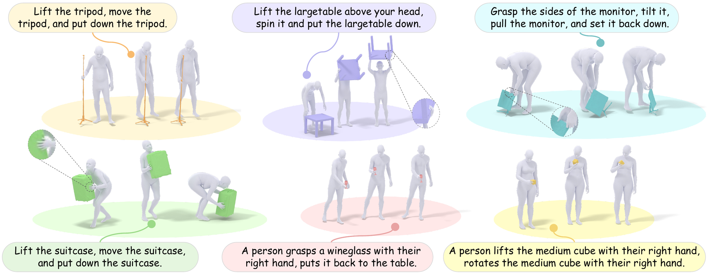
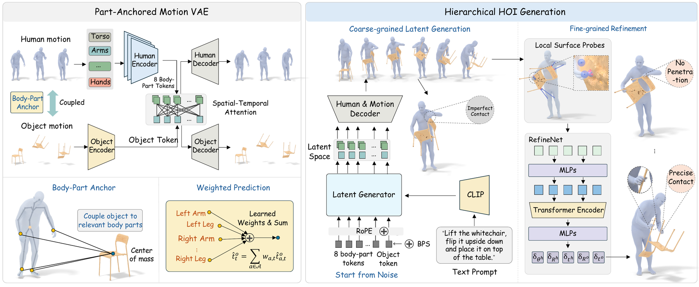

# PAMI: Part Anchored Motion for Text to Human-Object Interaction Generation

<p align="center">
  <a href="https://coral79.github.io/pami/"><b>[🌐 Project Page]</b></a>
  <a href="https://coral79.github.io/pami/Files/paper.pdf"><b>[📄 Paper]</b></a>
</p>

<p align="center">
  
</p>

This is the official repository for **PAMI**, a Part-Anchored Motion framework for text-conditioned full-body human–object interaction generation. Code, pre-trained checkpoints and evaluation scripts will be released here.

---

## 🚀 News
- **[2026]** PAMI preprint released. Code and models are being prepared for release — stay tuned!

## 📦 Release Progress
- [ ] **Data Preparation**: scripts to convert InterAct into the part-anchored interaction representation.
- [ ] **Model Weights**: pre-trained checkpoints for PamiVAE, PamiGen and PamiRefiner.
- [ ] **Inference Code**: text-to-interaction generation with PamiGen + PamiRefiner.
- [ ] **Training Code**: training scripts for PamiVAE, PamiGen and PamiRefiner.

---

## 📄 Abstract
Text-conditioned full-body human–object interaction (HOI) generation requires synthesizing human motion and object trajectories that match the input text while remaining precisely coordinated over time. Most methods represent the human and object as separate trajectories and predict the global human–object couplings. Learning this complex, dynamically changing relationship implicitly, however, often yields object drift, missed contact, and penetration.

We introduce **PAMI**, a Part-Anchored Motion framework for Interaction generation. Inspired by the classic Hough Transform, our key idea is to localize object motion by letting body-part anchors vote for it: we express object motion relative to multiple body-part anchors and use **PamiVAE** to learn an interaction latent space, decoding frame-wise weights that aggregate these part-specific votes. Building on this representation, PAMI generates interactions in a coarse-to-fine hierarchy. **PamiGen** first generates a coarse human–object interaction from text in this structured latent space, and **PamiRefiner** then recursively resolves fine-grained contact geometry using a hybrid surface-sensing representation, combining long-range probes that capture overall body-part influence with short-range sensors that resolve detailed contacts near the object surface.

Experiments on InterAct show that PAMI generates more faithful interactions and more accurate human-relative object motion than previous methods, achieving 14.5% higher contact recall than the previous state of the art. Extensive ablations validate the contributions of both the part-anchored voting representation and hybrid surface-sensing refinement.

<p align="center">
  
</p>

---

## ⚙️ Installation

*Coming soon.* The environment file and setup instructions will be added together with the code release.

---

## 🗂️ Data Preparation

<details>
<summary><b>Click to expand</b></summary>

PAMI is trained and evaluated on **[InterAct](https://github.com/wzyabcas/InterAct)**, a unified collection of text-annotated human–object interaction mocap datasets (OMOMO, CHAIRS, NeuralDome, IMHD, BEHAVE, GRAB, InterCap) with SMPL-H / SMPL-X bodies and object meshes.

1. Download InterAct following the instructions of the [official repository](https://github.com/wzyabcas/InterAct).
2. Obtain the SMPL-H and SMPL-X body models from [MANO](https://mano.is.tue.mpg.de/) / [SMPL-X](https://smpl-x.is.tue.mpg.de/).
3. Run our preprocessing scripts to build the part-anchored interaction representation (*coming soon*).

</details>

---

## 📥 Pre-trained Models

*Coming soon.* Checkpoints for the three modules will be hosted on HuggingFace:

| Module | Description | Checkpoint |
|---|---|---|
| **PamiVAE** | part-anchored interaction autoencoder (human body-part tokens + anchor-routed object) | *coming soon* |
| **PamiGen** | text-conditioned latent interaction generator | *coming soon* |
| **PamiRefiner** | hybrid surface-sensing refinement network | *coming soon* |

---

## 🎬 Inference

<details>
<summary><b>Click to expand</b></summary>

*Coming soon.* Generate a human–object interaction from a text prompt and an object mesh:

```bash
# placeholder — the final interface will be documented with the code release
python generate.py --text "Lift the suitcase, move the suitcase, and put down the suitcase." --object suitcase
```

The pipeline runs PamiGen (text → interaction latent), decodes the latent with PamiVAE, and applies PamiRefiner for a fixed number of recursive refinement steps.

</details>

---

## 🏋️ Training

<details>
<summary><b>Click to expand</b></summary>

*Coming soon.* Training proceeds in three stages; each script will be released with its configuration:

1. **PamiVAE** — part-anchored interaction autoencoder on InterAct.
2. **PamiGen** — text-conditioned latent generator on the PamiVAE latents.
3. **PamiRefiner** — refinement network trained on both generated samples and perturbed ground truth.

</details>

---

## 📊 Evaluation

<details>
<summary><b>Click to expand</b></summary>

*Coming soon.* We follow the evaluation protocol of LIGHT / InterAct on the InterAct test split (R-precision, FID, contact and penetration metrics).

</details>

---

## 👀 You Might Also Like

- 🧟 **[FrankenMotion](https://coral79.github.io/frankenmotion/)** (CVPR 2026) — part-level human motion generation and composition with the Frankenstein dataset.
- 🎯 **[ActionPlan](https://coral79.github.io/ActionPlan/)** (ECCV 2026) — future-aware streaming motion synthesis via frame-level action planning.

---

## ✍️ Citation
If you find our work or code useful for your research, please consider citing:

```bibtex
@article{li2026pami,
  title={{PAMI}: Part Anchored Motion for Text to Human-Object Interaction Generation},
  author={Li, Chuqiao and Xie, Xianghui and Cao, Yong and Geiger, Andreas and Pons-Moll, Gerard},
  journal={arXiv preprint},
  year={2026}
}
```

---

## 📜 License

This project is released under the [MIT License](LICENSE).

The InterAct data is subject to the licenses of its constituent datasets and must be obtained separately.

---

## ⭐ Star History

[](https://star-history.com/#Coral79/PAMI-Code&Date)
